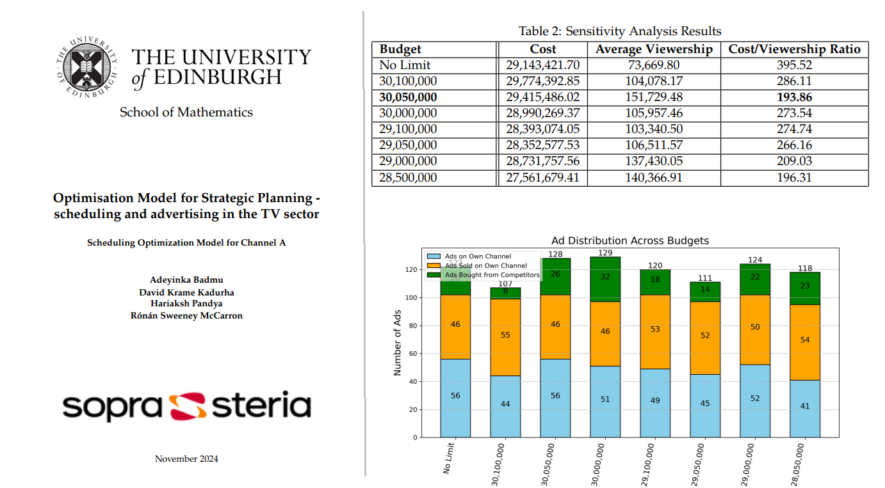

# Optimisation Model for Strategic Planning in the TV Sector

## Mathematical, Modelling and Consulting Skills – MSc Operational Research 2024/2025

### 0. Summary of Results

Click the image above to access the full project report in PDF format.

---

### 1. Repository Content Summary

This repository contains all the materials and scripts used for analyzing and optimizing strategies for a TV channel competing in a multi-channel environment. Below is a guide to its structure and key components:

#### **Key Documents**:
- **`0_MAIN_CODE_sensitivity_analysis_3_day.py`**: The primary script for conducting a 3-day sensitivity analysis.
- **`0_Global_Terminal_Output_Sensitivity_Analysis_3days.txt`**: Output log summarizing the results of the 3-day sensitivity analysis.

#### **Folders**:
- **`Complete_Work_History`**: A comprehensive archive of all versions and attempts prior to the final submission.
- **`Image_Analysis`**: Scripts and resources for analyzing images associated with the project.
- **`Images_EDA`**: Exploratory data analysis (EDA) focused on visual data.
- **`data`**: Raw data and preprocessed datasets used in the analysis.
- **`output`**: Outputs and results generated during the analysis.

#### **Notebooks**:
- Various Jupyter notebooks documenting detailed data analyses:
  - **`DataAnalysisResults3Days.ipynb`**
  - **`DataAnalysis_ConversionRates.ipynb`**
  - **`DataAnalysis_MovieDataBase.ipynb`**
  - **`DataAnalysis_MovieSchedules.ipynb`**
  - **`DataAnalysis_OurChannel.ipynb`**

#### **Scripts**:
- Analytical and utility scripts:
  - **`Vanilla_model_3Days.py`**, **`Vanilla_model_4Days.py`**: Baseline models for different time horizons.
  - **`ads_counting.py`**: Counting ad slots and occurrences.
  - **`advert_conversion_rates.py`**: Calculating advertisement conversion rates.
  - **`aggregate_first_week.py`**: Aggregating data from the first week of analysis.
  - **`get_ad_slot_movie_conversion.py`**: Mapping ad slots to movie conversion rates.
  - **`license_fee_calc.py`**: Calculating licensing fees for movies.
  - **`probabilities_integrated_1.py`**: Integrating probabilistic models.
  - **`revenue_calc.py`**: Revenue estimation based on inputs.
  - **`sample_movie_db.py`**: Sampling movie data.
  - **`time_slot_viewership.py`**: Estimating viewership by time slot.

---

### Link to the Mathematical Model in Overleaf

[Click here to view the model on Overleaf](https://www.overleaf.com/9631347139bgqygbhyzjjz#7ba809)

---

### 2. Introduction

This project presents a small-scale set of competitor TV channels, exploring optimal solutions for maximizing viewership through intelligent scheduling and planning a cost-effective advertising strategy. The challenge considers four channels streaming movies all the time, with daily programming running from 7 AM until midnight and 5-minute time slots every 30 minutes.

As consultants hired by a TV channel, we received a blank timeline along with the planned schedules for three competitors. The primary objective is to deliver a systematic methodology to optimize the channel’s own viewership, retaining existing audiences and attracting new viewers, while adapting to competitors' scheduling strategies.

---

### 3. Key Facts About the Data

The simulated data aims to represent realistic distributions and logical relationships, although gaps and inconsistencies may exist. The following datasets are included:

- **Movie Database**: Nearly 6,000 titles from which channels can choose.
  - Movie Title
  - IMDb Average Vote (1-10)
  - Vote Count
  - Release Date
  - Box Office Revenue
  - Run Time
  - Budget
  - Genre(s)
  - Number of Ad Breaks
  - Runtime with Ads
  - Children, Adults, and Retirees Scaled Popularity

- **Channels’ Schedule Databases** (Competitor Channels 0, 1, and 2): 
  - Date-Time (5-min slots)
  - Content Type (Movie/Advert)
  - Popularity Scores and View Counts for Children, Adults, and Retirees
  - Prime Time Factor
  - Ad Slot Price

- **Channels’ Conversion Rates**: Probability that advertising on a competitor channel leads to positive conversion into your own channel.

- **Your Channel Schedule**: Baseline view counts and prime time factors for children, adults, and retirees.

---

### 4. Stochastic Modelling

Advertising increases viewership through probabilities, with viewership calculated based on baseline counts multiplied by popularity. The model incorporates conversion rates based on advertising placements on competitors’ channels.

---

### 5. Key Objectives and Constraints

The main objectives are to maximize overall viewership through:
- Intelligent scheduling aligned with competitors’ schedules.
- Efficient advertising strategies using both own and competitors’ channels.

Expenses include streaming license fees and advertising costs, while revenue is driven by viewership and sold advert slots.

---

### 6. Timeline and Iterative Approach

The model optimizes the TV channel’s schedule and advertising over the first week, starting from 01 October 2024. An iterative approach will refine strategies based on weekly learnings and adjustments to advertising budgets.

---

### 7. Exploratory Questions

The executive board seeks recommendations to enhance the optimization strategy, focusing on aspects such as optimal pricing for advert slots, competitor scheduling tactics, minimum revenue thresholds, demographic trends, content strategies, and more.

---

### Authors
- Adeyinka Badmus
- David Krame Kadurha
- Hariaksh Pandya
- Rónán Sweeney McCarron
